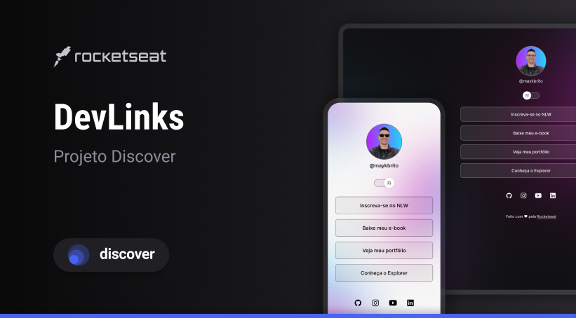

<h1 aling="center">DevLinks</h1>

 Programa Gratuito promovido pela Rocketseat

## Tecnologias

Esse projeto foi desenvolvido com:

- HTML e CSS
- JavaScript
- Git e GitHub
- Figma

# Projeto
O DeveLinks é um agregador de links para usar como cartão de visitas online